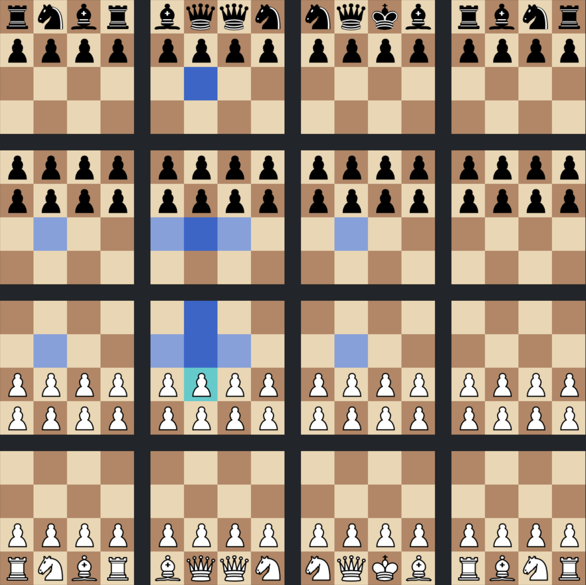

# 4D-Chess
A general chess program that supports different board shapes (including higher dimensional ones) and different combinations of rules. This readme contains a list of features as well as examples of variants with images. This software is proprietary but you can clone and compile it for personal use on your own computer. You need SDL2 and SDL2_image. Modify the makefile as necessary, and the main.c.

## Examples of variants
8x8 chess but on a 10x10 board\

Long range chess, but you move twice. The two moves has to be with different pieces.\

4D chess. It's chess on four dimensional hypercube, here visualized in two dimensions. The selected pawn can move one or two steps forward either in "dimension 2" or in "dimension 4", and could capture diagonally to any of the squares highlighed in light blue if there was an opponents piece there.\

3D chess. Chess on a 5x5x5 cube. Imagine the leftmost one being on the bottom and the other four stacking on top.\

Another version of 4D chess, here on a 3x3x3x3 hypercube. Note that that none of the pieces are attacked, though after any move by white that piece will be attacked. By the way, kings only move horizontally in higher-dimensional chess. Checkmating would otherwise be way too difficult.\

A third version of 4D chess. Note that if there was a white bishop on for example A1a1, it would be able to capture the black piece on A3a3 on move one. Defining a reasonable starting position is tricky for high dimensional chess. Note also that all pawns are defended.\

Ten move chess. White makes five moves, and then it is ten moves per turn until a king is captured. The moves have to be with different pieces. Is this variant even remotely playable? I think so.\

## List of features - variants are defined using any combination of these features
- Any number of dimensions - 2, 3, 4, 14, anything (actually 14 is the limit. We don't have enough pixels on our screens for more than 14 dimensional chess.).
- Any side lengths - Chess on a 6x3x4x2x5 hyperrectangle, why not? Also: why?
- Any dimensions wrapping around the edge - move one step forward from D8 and arrive on D1
- "Forward" and "non-forward" dimensions. Pawns normally move forward in forward dimensions, and capture diagonally one step forward in a forward dimensions and one step in a non-forward dimension.
- Pawns moving in specified direction. Forward/backwards in forward dimensions, or forward/backwards in non-forward dimensions (ie right/left).
- Any number of moves per turn for each player. Allow or don't allow moving the same piece twice in one turn.
- Multiple different win conditions - Checkmate, king captured, king arrived to target square
- Gravity - pieces fall down in the direction of gravity
- Invincible king - king can't capture or be captured. Win by reaching target square (or any other win condition, if you so choose)
- Define where pawns promote. Define which pieces other than pawns that can promote

## List of upcoming features
- Non-(hyper)rectangle board shapes - circle, square with a hole in it, tetrahedon, whatever
- Parts of the board where only one player is allowed to be
- Parts of the board where only one player is allowed to capture pieces
- More than two players
- Simultaneous moves
- Capture the flag feature
- Tower defence feature - don't let the opponents pieces get through
- Other win conditions
- Variant maker - define the board shape and rules yourself
- Engine that can play any variant
- Proper UI and game selection

## Philosophy
I like chess variants that are basically normal chess but with one or two twists. Variants that anyone who knows the rules of chess will immediately understand how to play. None of the variants here uses pieces other than the normal ones. Now, the higher dimensional variants are obviously not easy, since most of us have some trouble thinking in more than three dimensions.
